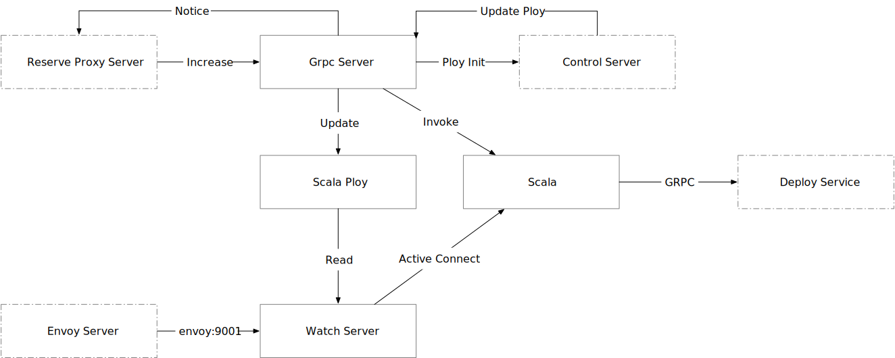

# Monitor
> 监控当前所有的服务实例状态变化. 

`monitor server`会启动两个内部服务: 

+ `watch server` 监听`prometheus proxy`运行数据，并会根据`control server`下发的`ploy`数据来调整服务实例数据。
+ `grpc server` 处理外部主动发起的涉及到服务实例的扩缩容请求和来自`control server`的策略更新

流程图如下:

+ Environment

  - TIO_MONITOR_PROMETHEUS_ADDR (数组)
  - TIO_MONITOR_CONTROL_ADDR
  - TIO_MONITOR_PROXY_ADDR (数组)
  - TIO_MONITOR_DEPLOY_ADDR