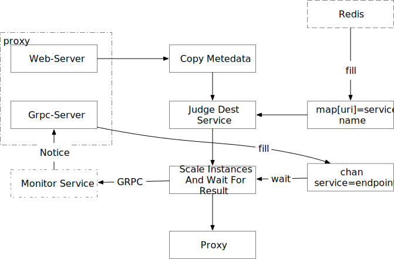

# Proxy

> 当服务实例为0时，负责缓冲外部请求，当实例被创建之后，再继续转发此请求

### Http Proxy

`http-proxy` 流程图.  `web-server` 监听`80`, `grpc-server`监听`8000`

+ Environment

  - REDIS
  
    - TIO_PROXY_REDIS_ADDR
    - TIO_PROXY_REDIS_PASSWD
    - TIO_PROXY_REDIS_DB
    
  - MONITOR
  
    - TIO_MONITOR_ADDR